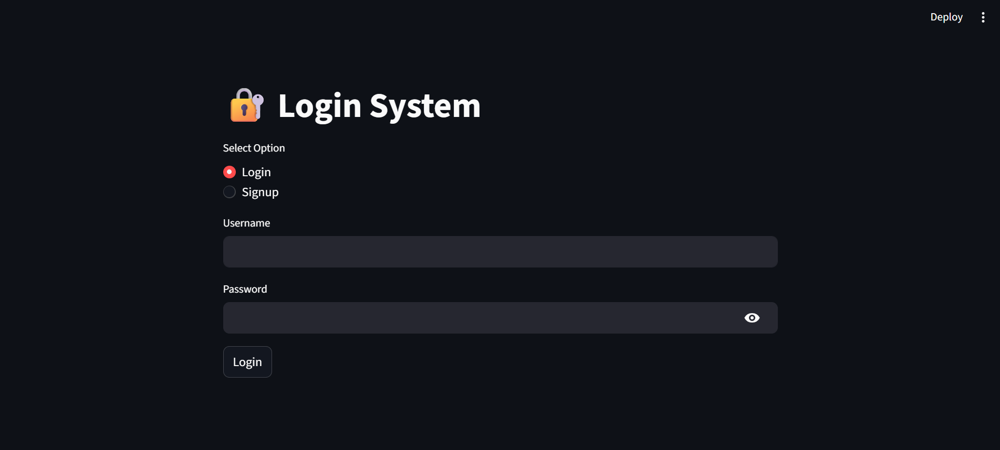
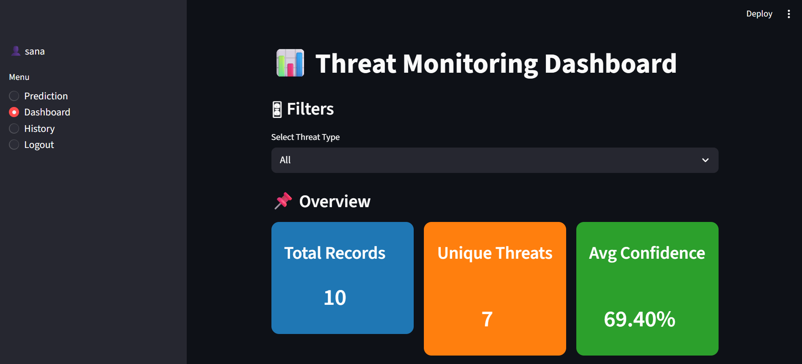
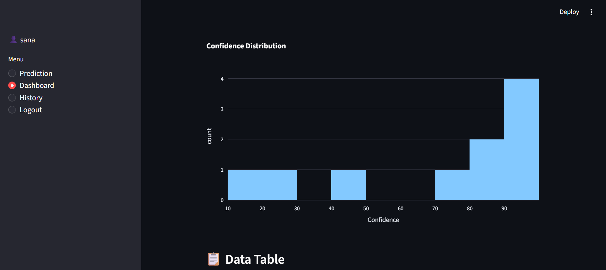
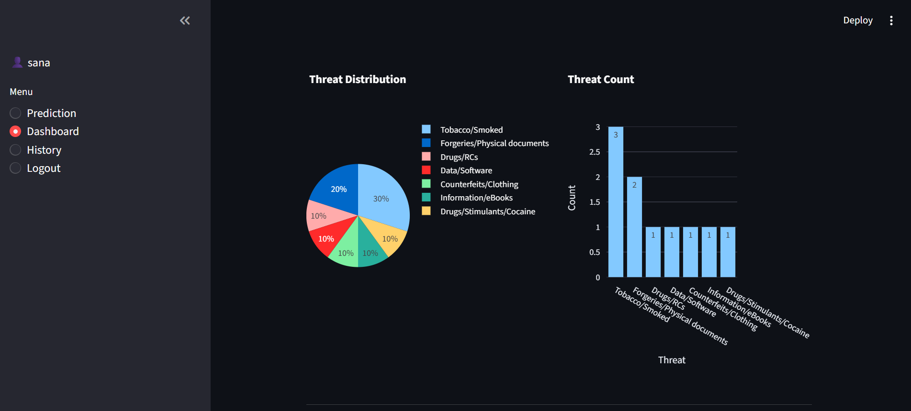
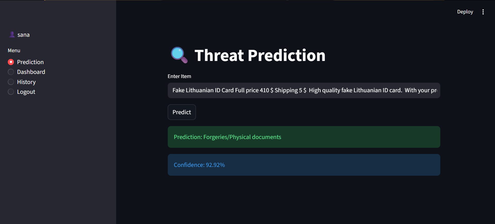
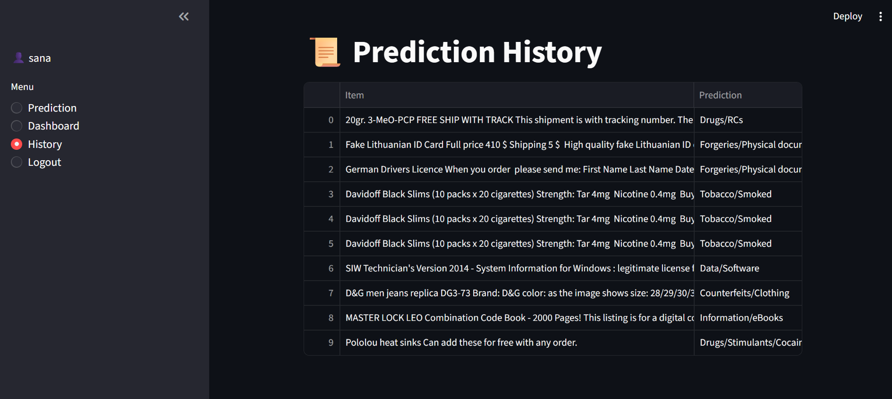

# 🛡️ AI Threat Detection System

An AI-powered Threat Detection System built using **Machine Learning**, **Streamlit**, and **SQLite**.  
This project predicts possible threat categories from user input text and provides a real-time monitoring dashboard with analytics and prediction history.

---

## 🚀 Features

- 🔐 User Authentication System (Login & Signup)
- 🤖 AI-Based Threat Prediction
- 📊 Interactive Threat Monitoring Dashboard
- 📜 Prediction History Tracking
- 📈 Confidence Score Visualization
- 💾 SQLite Database Integration
- ⚡ Fast ML Predictions using TF-IDF + Logistic Regression

---

## 🛠️ Technologies Used

- Python
- Streamlit
- Scikit-learn
- Pandas
- SQLite
- Plotly
- Joblib

---

## 📂 Project Structure

```bash
AI-Threat-Detection/
│── app.py
│── train_model.py
│── rf_model.pkl
│── tfidf_vectorizer.pkl
│── users.db
│── Agora.csv
│── requirements.txt
│── README.md
│── loginpage.png
│── dashboard.png
```

---

## 🧠 Machine Learning Workflow

1. Dataset Preprocessing
2. Text Cleaning
3. TF-IDF Vectorization
4. Logistic Regression Training
5. Threat Prediction
6. Dashboard Analytics

---

## 📸 Screenshots

### 🔐 Login Page



---

### 📊 Dashboard





---
---
### Prediction page


---
---
### History Page


---
## ⚙️ Installation

Clone the repository:

```bash
git clone https://github.com/your-username/AI-Threat-Detection.git
```

Move into project folder:

```bash
cd AI-Threat-Detection
```

Create virtual environment:

```bash
python -m venv venv
```

Activate virtual environment:

### Windows

```bash
venv\Scripts\activate
```

### Mac/Linux

```bash
source venv/bin/activate
```

Install dependencies:

```bash
pip install -r requirements.txt
```

---

## ▶️ Run Application

```bash
streamlit run app.py
```

---

## 📊 Model Information

- **Vectorizer:** TF-IDF Vectorizer
- **Algorithm:** Logistic Regression
- **Text Features:** Unigrams + Bigrams
- **Max Features:** 8000

---

## 📌 Future Improvements

- Deep Learning Integration
- Real-Time Threat Alerts
- Cloud Deployment
- User Activity Logs
- Advanced Threat Analytics

---

## 👨‍💻 Author

Developed by SAHANA M M

---
